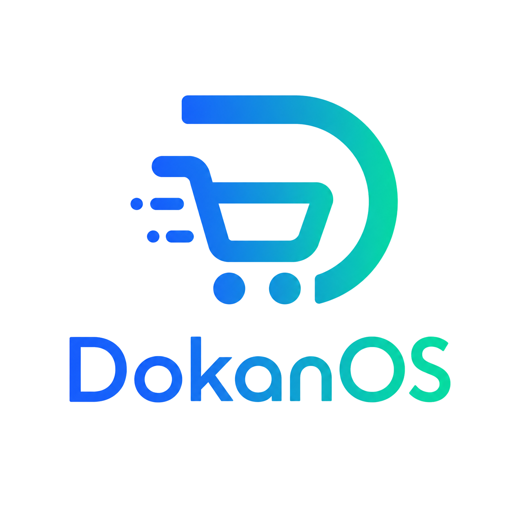

# DokanOS

  

  <strong>The all-in-one shop operating system for Bangladeshi e-commerce.</strong> 
  WooCommerce orders, Pathao courier dispatch, POS, inventory, customers and analytics - all in one dashboard.

  
  
  
  
  
  

## Overview

Small and medium Bangladeshi e-commerce shop owners typically juggle separate tools: a WooCommerce admin panel, the Pathao merchant dashboard, a standalone POS app, and spreadsheets for inventory. DokanOS replaces that fragmented workflow with a single web app, so a shop owner can run their entire business - online and offline - without opening another admin panel.

Built Bangladesh-native by default: currency in Bangladeshi Taka (BDT), native Pathao courier integration, and the Bangladesh city > zone > area location hierarchy. Works on desktop browsers and on the go as an installable PWA.

## Key Features

- **WooCommerce Integration** - Bidirectional sync of orders, products (with variations), categories, and customers; real-time webhook processing plus bulk sync.
- **Pathao Courier** - Bulk parcel dispatch, auto-filled city / zone / area from customer addresses, tracking status sync, and COD remittance handling.
- **Point of Sale (POS)** - Walk-in sales, barcode scanning, cash / card / mobile payments, due-collection tracking, and daily cash reports.
- **Order Management** - Tabbed pipeline (New, Pre-Order, Payment Pending, Shipped, Delivered, Cancelled), per-order timelines, exchange / return workflows, and pickup slip printing.
- **Products and Inventory** - WooCommerce-synced catalog with stock management, variations, categories, and low-stock alerts.
- **Customers** - Global phone-based identity with cross-store alias resolution and complete order history.
- **Analytics and Reports** - Revenue trends, order source mix, payment-method breakdown, top products, fulfillment funnel, and POS cash reports.
- **Storefronts** - Headless storefront builder with COD and online payment checkout.
- **Measurements** - Custom measurement groups and fields attached to order items (for example, tailoring dimensions).
- **Teams and Roles** - Supabase authentication with team invites and role-based access control (owner, manager, staff).
- **Multi-Store** - Manage multiple WooCommerce stores from a single DokanOS account.
- **PWA** - Installable on desktop and mobile, fully functional on any screen size.

## Tech Stack

| Layer | Technology |
| --- | --- |
| Frontend | React 18, TypeScript, Vite, React Router, TanStack Query |
| UI | Tailwind CSS, shadcn/ui (Radix primitives), Recharts, Sonner |
| Forms | react-hook-form + zod |
| Backend | Supabase - PostgreSQL, Auth, and Deno Edge Functions |
| Integrations | WooCommerce REST API + webhooks, Pathao courier API |
| Testing | Vitest + React Testing Library, Playwright |
| Hosting | Vercel (web app), Supabase cloud (database and functions) |

## License

Private project. All rights reserved.